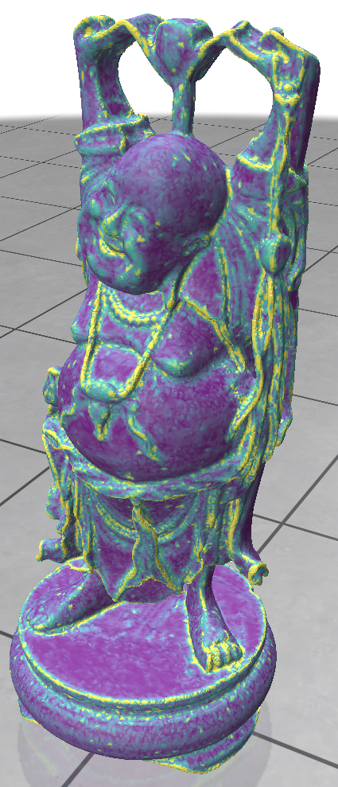

# Curvescope

A mean curvature viewer based on [Polyscope](https://polyscope.run/).


## Details

  A simple C++ viewer for *mean curvature* vizualization of triangular meshes, built upon the 3D data manipulation and vizualization library [Polyscope](https://polyscope.run/). 
  Supports `.obj`, `.ply`, and `.off` files.

  The implementation is based on *"Discrete Differential-Geometry Operators for Triangulated 2-Manifolds, Meyer et al"*. Specifically, the *mean curvature* K(x<sub>i</sub>) vector at each vertex of the mesh x<sub>i</sub> is computed according to:

  

  For the computation of the vertex area A<sub>mixed</sub> two approaches are considered:
- Voronoi vertex areas are computed according to the the algorithm described in Fig.4 of the afforementioned paper.
- Barycentric areas are provided natively by Polyscope.

## How-To

#### Compile & run
  To download, run:

```
git clone --recurse-submodules https://github.com/alexdkeros/Curvscope.git
```

  To compile the code, navigate to the project's directory and run:
  
```
mkdir build
cd build
cmake ..
make
```

  The executable will be located in `<project directory>/build/bin/curvscope`.


#### How to use

  In order to launch the viewer, from the project's directory, run:
  
```
./build/bin/curvscope [path/to/mesh1.obj path/to/mesh2.ply path/to/mesh3.off ...]
```
(Command line arguments are optional)

  How to use the Command UI:
  
  
  
#### Dependencies

  Curvscope only depends on Polyscope, which packages all its source code dependencies with the repository.

  Polyscope is included as a `git submodule`.


## Showcase


#### Standard examples

In the following examples mean curvature is computed with `Mean Curvature (Voronoi areas)`:
| Model       |   Vizualization | Comments |
| ----------- |  ----------- | ----------- |
| plane      |   | Zero mean curvature at non-boundary vertices. |
| sphere   |  | (Near-) constant curvature K=1. |
| torus    |  | Smoothly decreasing curvature. | 
| spot     |  | Vizualization of mean curvature vectors. Unseen vectors may point inwards (for example, at the horns), or have zero magnitude. |
| happy buddha |  | "Big and complicated" mesh. |


#### Voronoi vs barycentric vertex areas

###### The torus case

| Mean Curvature (Voronoi areas) | Mean Curvature (Barycentric areas) |
|--------------------------------|------------------------------------|
| | |

  Barycentric areas can cause irregularities in curvature computation due to triangulation peculiarities, as seen below:

| Voronoi vertex areas | Barycentric vertex areas |
|--------------------------------|------------------------------------|
| | |

###### The sphere case

  Similarly to the torus case, barycentric vertex areas on the sphere can cause outliers in curvature computation.

| Mean Curvature (Voronoi areas) | Mean Curvature (Barycentric areas) |
|--------------------------------|------------------------------------|
| | |

#### Mean curvature flow

  A *very* crude implementation of mean curvature flow, according to the computed mean curvature vectors. Unfortunately, when face areas become too small singularities cause them to get deleted.

| Before | After |
|--------------------------------|------------------------------------|
| ||
| ||

#### Comparison with libIGL (alternative implementation)

  An alternative approach would be to use [libIGL](https://libigl.github.io/), a handy geometry processing library. To this end, one only needs to clone the [Polyscope-libIGL project template](https://github.com/nmwsharp/libigl-polyscope-project-template) and add the following functions in `main.cpp`, with their respective callbacks. Examples of these functions are provided in the [libIGL tutorial](https://libigl.github.io/tutorial/#curvature-directions).
  
  The Laplace-Beltrami operator approach:

```
void addMeanCurvatureScalar() {
  using namespace Eigen;
  using namespace std;

  MatrixXd HN;
  VectorXd H;
  SparseMatrix<double> L,M,Minv;


  igl::cotmatrix(meshV,meshF,L);
  igl::massmatrix(meshV,meshF,igl::MASSMATRIX_TYPE_VORONOI,M);
  igl::invert_diag(M,Minv);
  HN = -Minv*(L*meshV);
  H = HN.rowwise().norm(); //up to sign

  polyscope::getSurfaceMesh("input mesh")
      ->addVertexScalarQuantity("mean curvature", H,
                                polyscope::DataType::SYMMETRIC);

  polyscope::getSurfaceMesh("input mesh")
      ->addVertexVectorQuantity("mean curvature vectors", HN);

}
```

  The Quadratic fit approach:

```
void addMeanCurvatureQuadFitScalar() {
  using namespace Eigen;
  using namespace std;

  VectorXd H;
  MatrixXd PD1,PD2;
  VectorXd PV1,PV2;

  igl::principal_curvature(meshV,meshF,PD1,PD2,PV1,PV2);
  // mean curvature
  H = 0.5*(PV1+PV2);
x
  polyscope::getSurfaceMesh("input mesh")
      ->addVertexScalarQuantity("mean curvature (QuadFit)", H,
                                polyscope::DataType::SYMMETRIC);


  polyscope::getSurfaceMesh("input mesh")
      ->addVertexVectorQuantity("Principal vec1", PD1);

  polyscope::getSurfaceMesh("input mesh")
      ->addVertexVectorQuantity("Principal vec2", PD2);

}
```

Timing comparisons on example meshes (average of 10 executions):

| Mesh | Ours (Voronoi vertex areas) | Laplace-Beltrami operator | Quadratic fit |
|------|-----------------------------|---------------------------|---------------|
| spot |         3ms                 |             118ms         |     2764ms    |
| bunnyhead |         1ms                 |             67ms         |    1528ms    |


Example mean curvature vizualization on `bunnyhead` (colorscale range [0-20]):

| Ours (Voronoi vertex areas) | Laplace-Beltrami operator | Quadratic fit |
|-----------------------------|---------------------------|---------------|
|       |                |        |


